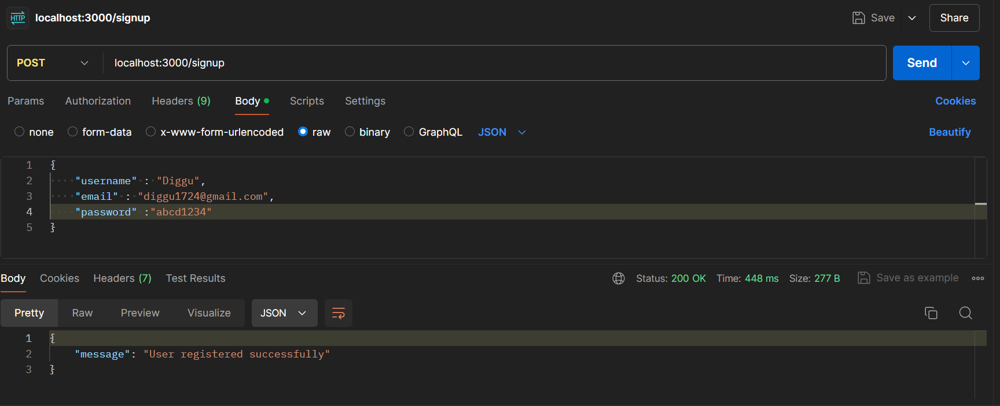
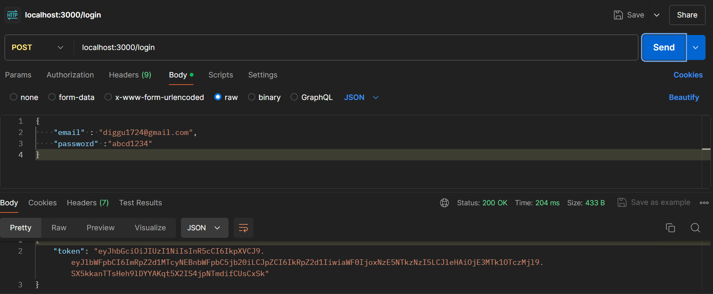
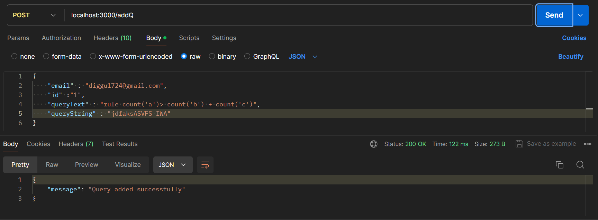
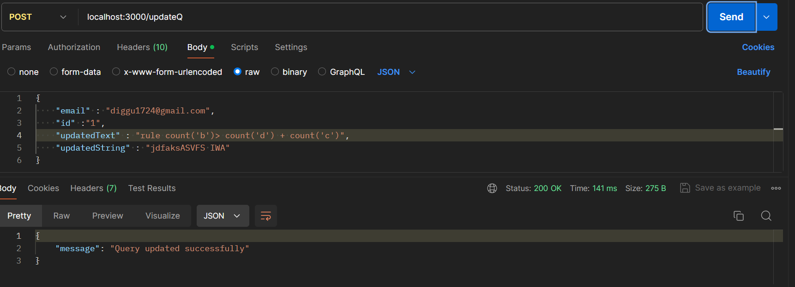
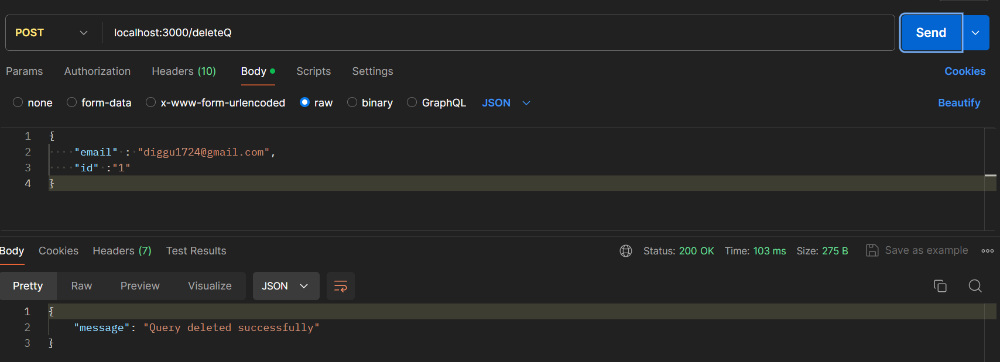
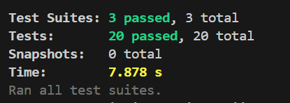

# TITLE: Real-time Data Classification API

## DESCRIPTION: 
The goal of this project is to provide a stable and adaptable platform that can analyze and categorize real-time data streams according to rules that the user defines. Utilising state-of-the-art backend technology and web technologies, it guarantees accurate and rapid data processing. Because of this, the platform is perfect for applications that need efficient data handling and real-time decision-making.

## TABLE OF CONTENT:
- [🎯 Purpose](#-purpose)
- [👩🏻‍💻 Features](#-features)
- [🛠️ Tools & Technologies](#-tools)
- [📥 Installation](#-installation)
- [📧 Endpoints](#-endpoints)
- [🧪 Testing](#-testing)
- [🖼️ Postman](#-images)
- [🖼️ Contact](#-contact)

## 🎯 Purpose
This project's main objective is to offer a real-time, scalable data processing system that allows users to create custom classification rules. This project guarantees that user-defined rules may be applied promptly to incoming data, making the system ideal for a variety of real-world applications. It accomplishes this by integrating JWT for secure authentication, a strong database for rule storage, and real-time data streaming capabilities.


## 👩🏻‍💻 Features
Some of the key features of the projects are:

i. JWT Authentication

    ->JWT Authentication Middleware: Middleware has been integrated to handle JWT authentication, ensuring secure access to protected routes.
    ->Token Validation: All incoming requests are validated to ensure they contain a valid JWT token in the header, safeguarding against unauthorized access.
    ->User Signup and Login Endpoints: I have created endpoints for user signup and login, enabling users to securely register and authenticate.

ii. Data Models and Database Integration
    The project includes a comprehensive design and implementation of the database schema, focusing on user-defined rules and associated operations

    -> Schema design for storing user and rule data.
    -> CRUD operations for managing user-defined classification rules.
    -> Integration with a database for persistent storage.

iii. User-Defined Classification Rules

    -> Parser to interpret and validate user-defined rules.
    -> API endpoints for rule management (create, read, update, delete).

iv. Real-time Data Processing    

    -> WebSocket or Server-Sent Events (SSE) for live data streaming.
    -> Real-time classification engine to process data streams using defined rules

## 🛠️ Tools & Technologies
- **Backend**: Express, Node.js
- **Database**: MongoDB
- **Authentication**: JSON Web Token (JWT)
- **Real-Time Processing**: WebSocket
- **Unit/Integration Testing**: Jest with Supertest
- **Load Testing**: Apache JMeter
- **API Request Platform**: VS Code - Postman

## 📥 INSTALLATION
To get started with the Real-time Data Classification API, follow the below steps:
#### Clone the repository
```bash
git clone https://github.com/diggu17/Live-stream-api.git
cd Live-stream-api
```
#### Install dependencies using npm
```bash
npm install
```


## 📧 Endpoints

**Create an User**:
  ```bash
  http://{{host}}:{{port}}/signup
  ```
- **Login a user**:
  ```bash
  http://{{host}}:{{port}}/login
  ```
- **Create a Rule**:
  ```bash
  http://{{host}}:{{port}}/addQ   # Adding New Rule
  ````
- **Update a Rule**:
  ```bash
  http://{{host}}:{{port}}/updateQ    # Updating a rule 
  ```
- **Delete a Rule**:
  ```bash
  http://{{host}}:{{port}}/deleteQ    # Deleting a rule
  ```
 - **running query by a user**:
  ```bash
  http://{{host}}:{{port}}/run-query  #running all rules 
  ```

## 🧪 Testing
Run below coomand to run unit tests , integration tests and see the code covarage for this project
 ```bash
  npm test
 ```

## 🖼️ Postman 
#### Creating a new User

#### Login a User

#### Creating a New Rule

#### Update a Rule

#### Delete a Rule

#### Testing



## 📞 Contact

Author Name - Digvijay Singh Thakur

Email - digvijaysinghtahkur17@gmail.com


## Metric of Load
Using express gives 450 HTTP request with ramp up period of 1sec 

 
